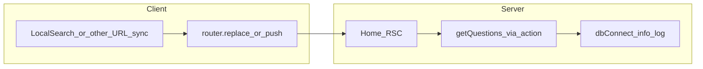

# Fix continuous "Using existing mongoose connection" logs

## What the log actually means

In `[apps/web/lib/mongoose.ts](apps/web/lib/mongoose.ts)`, `logger.info('Using existing mongoose connection')` runs on **every** `await dbConnect()` when `cached.conn` is already set:

```30:33:apps/web/lib/mongoose.ts
const dbConnect = async (): Promise<Mongoose> => {
  if (cached.conn) {
    logger.info('Using existing mongoose connection');
    return cached.conn;
```

So continuous logs imply **many server invocations** (RSC refetch, server actions, API routes), not a broken singleton. The home path loads data via `getQuestions` in `[apps/web/app/(root)/page.tsx](apps/web/app/(root)`/page.tsx), which calls the shared `[action](apps/web/lib/handlers/action.ts)` helper — and `**action` always calls `dbConnect()`** before running the handler:

```48:49:apps/web/lib/handlers/action.ts
  await dbConnect();
  return { params, session };
```

Each refetch of `/` (or soft navigation that re-executes the RSC tree) produces another log line.




## Why the prior plan may not be enough

The completed plan in `[.cursor/plans/fix_home_render_loop_4c0d5df7.plan.md](.cursor/plans/fix_home_render_loop_4c0d5df7.plan.md)` guarded navigation with `targetUrl !== currentUrl`, but **both strings are built differently**:

- `currentUrl` uses `pathname` + `searchParams.toString()` from Next (`[LocalSearch.tsx](apps/web/components/search/LocalSearch.tsx)`).
- `targetUrl` comes from `[formUrlQuery` / `removeKeysFromUrlQuery](apps/web/lib/url.ts)`, which use `**query-string`**’s `stringifyUrl` on `window.location.pathname`.

Those can still differ for the **same** logical URL because of **encoding and serialization rules** (notably `URLSearchParams.toString()` vs `query-string` stringify: e.g. space as `+` vs `%20`, subtle ordering/encoding). If they never normalize to the same string, `router.replace` runs on every debounced tick → endless RSC refetch → endless `dbConnect()` → endless logs.

Separately, `[GlobalSearch.tsx](apps/web/components/search/GlobalSearch.tsx)` (navbar) still calls `router.push` on the empty-query path **without** comparing to the current URL — worth aligning when fixing URL sync holistically.

## Recommended fix (senior-level, ordered)

### 1. Make "should I navigate?" authoritative (primary fix)

In `[LocalSearch.tsx](apps/web/components/search/LocalSearch.tsx)` (and then the same pattern in `[GlobalSearch.tsx](apps/web/components/search/GlobalSearch.tsx)` if it is mounted on the layout):

- Prefer **semantic comparison** over raw string inequality, e.g. for local question search: navigate only when `(searchParams.get('query') ?? '') !== searchQuery` (optionally after `trimEnd` / agreed trim rules), and for cleanup only when `searchParams.has('query')` and `searchQuery === ''`.
- If you keep a string guard, **normalize both sides the same way** before comparing: e.g. parse with `URLSearchParams`, compare sorted entries, or compare using one serializer only (either always `query-string` for both `current` and `target`, or always `URLSearchParams` + stable `sort` of keys).

This removes false-positive navigations regardless of `+` vs `%20` or param ordering.

### 2. Stabilize the debounce effect dependencies

`useSearchParams()` returns a stable-enough API, but listing `searchParams` in the dependency array can still cause extra effect churn depending on parent re-renders. Prefer depending on `**searchParams.toString()`** (or the specific param values you care about) so the effect runs when the URL actually changes, not only when object identity might churn.

### 3. Optional: align URL helpers with Next (`url.ts`)

`[apps/web/lib/url.ts](apps/web/lib/url.ts)` currently logs to the browser console on every call and uses `window.location.pathname` inside helpers consumed by multiple components. Longer-term cleanliness:

- Consider helpers that accept `pathname: string` explicitly (from `usePathname()`), and build the next URL with a single serialization strategy, so **all** filters/search/pagination share one implementation and comparisons stay honest.

### 4. Observability / noise control in `mongoose.ts` (secondary, not a substitute)

Even with a healthy app, `info` on every hot-path `dbConnect()` is noisy in dev and misleading in production metrics.

- Remove the log in the `cached.conn` branch, **or** downgrade to `logger.debug`, **or** log once behind a module-level `hasLoggedReuse` flag if you truly need a startup breadcrumb.

This does **not** fix excess traffic; it only stops the console from shouting once (1) is fixed.

### 5. Verification checklist

- DevTools **Network**: confirm RSC/`/` traffic stops spiking when idle on `/` with an empty search box and with a query that contains spaces.
- Terminal: `dbConnect` should log at most once per real navigation, not continuously.
- Regression: typing, clearing, `filter` + `query` together, and pagination still update the URL as expected.

## Files to touch (expected)


| Area                             | File                                                                                         |
| -------------------------------- | -------------------------------------------------------------------------------------------- |
| Primary                          | `[apps/web/components/search/LocalSearch.tsx](apps/web/components/search/LocalSearch.tsx)`   |
| Same class of bug                | `[apps/web/components/search/GlobalSearch.tsx](apps/web/components/search/GlobalSearch.tsx)` |
| Shared URL building / comparison | `[apps/web/lib/url.ts](apps/web/lib/url.ts)` (if centralizing normalization)                 |
| Log hygiene                      | `[apps/web/lib/mongoose.ts](apps/web/lib/mongoose.ts)`                                       |


