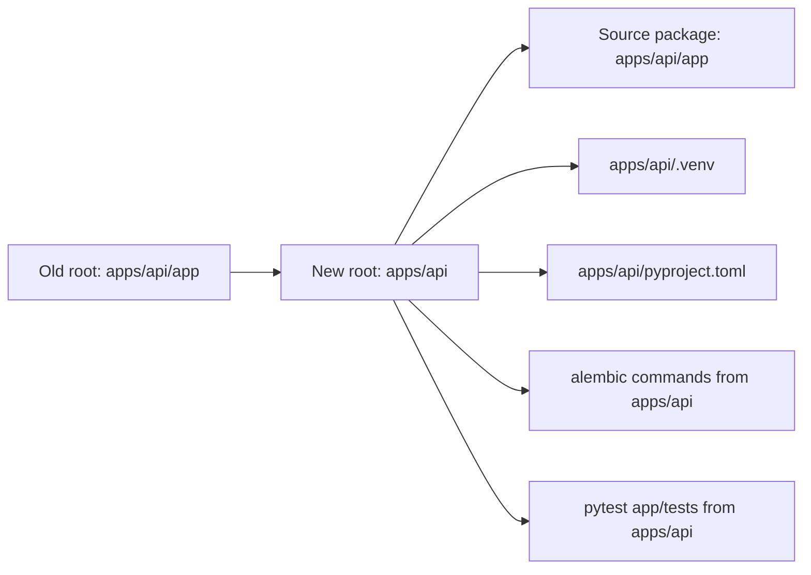

# Plan: Move `pyproject.toml` to `apps/api`

## Target outcome

Use `apps/api` as the single Python project root, with source code still in `apps/api/app`.

- `pyproject.toml` at [apps/api/pyproject.toml](apps/api/pyproject.toml)
- lockfile at [apps/api/uv.lock](apps/api/uv.lock)
- venv at `apps/api/.venv`
- Alembic commands run from `apps/api`
- imports/tests use package-style `app.*` consistently

## 1) Move project metadata and lock context

- Move [apps/api/app/pyproject.toml](apps/api/app/pyproject.toml) -> [apps/api/pyproject.toml](apps/api/pyproject.toml).
- Move [apps/api/app/uv.lock](apps/api/app/uv.lock) -> [apps/api/uv.lock](apps/api/uv.lock) (or regenerate via `uv sync`).
- Keep source package in [apps/api/app](apps/api/app).

## 2) Recreate environment at new root

- Remove old venv under `apps/api/app/.venv`.
- Create/sync venv from `apps/api` (`uv sync`) so executables and shebangs point to the new root.
- Ensure editor interpreter path points to `apps/api/.venv/bin/python` in [.vscode/settings.json](.vscode/settings.json).

## 3) Normalize command entrypoints

- FastAPI run command from `apps/api`:
  - `uv run fastapi dev app/main.py` or `uv run uvicorn app.main:app --reload`
- Alembic command root should become `apps/api`:
  - place/use `alembic.ini` from `apps/api` and script path to `app/alembic`
- Update any docs/scripts referencing `apps/api/app` command root.

## 4) Align Alembic config paths after move

- Update [apps/api/app/alembic.ini](apps/api/app/alembic.ini) location strategy (either move file to `apps/api/alembic.ini` or keep and call with `-c`; preferred: move to root).
- Verify `script_location` resolves to [apps/api/app/alembic](apps/api/app/alembic).
- Confirm `env.py` imports still resolve from new root in [apps/api/app/alembic/env.py](apps/api/app/alembic/env.py).

## 5) Fix test import stability

- In [apps/api/app/tests/conftest.py](apps/api/app/tests/conftest.py), standardize to package import:
  - `from app.main import app`
- Run pytest from `apps/api` (`uv run pytest -q app/tests`) to avoid cwd-dependent import errors.
- Remove temporary `sys.path` hacks if present.

## 6) Validation checklist

- `uv run fastapi dev app/main.py` works from `apps/api`.
- `uv run alembic revision --autogenerate ...` works from `apps/api`.
- `uv run alembic upgrade head` applies migrations correctly.
- `uv run pytest -q app/tests` passes collection/import stage.
- OpenAPI routes still expose `users`, `accounts`, and `health` endpoints.

## 7) Documentation updates

- Update [apps/api/README.md](apps/api/README.md) commands to run from `apps/api` root.
- Update migration/test notes in docs if they reference old `apps/api/app` execution paths.

